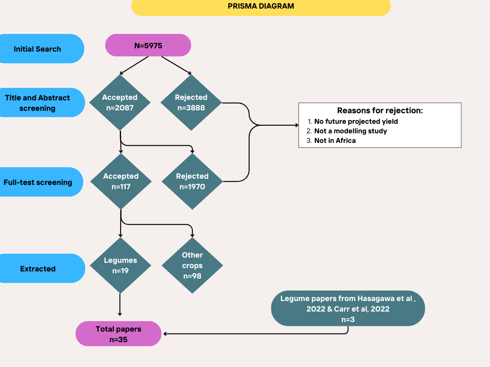
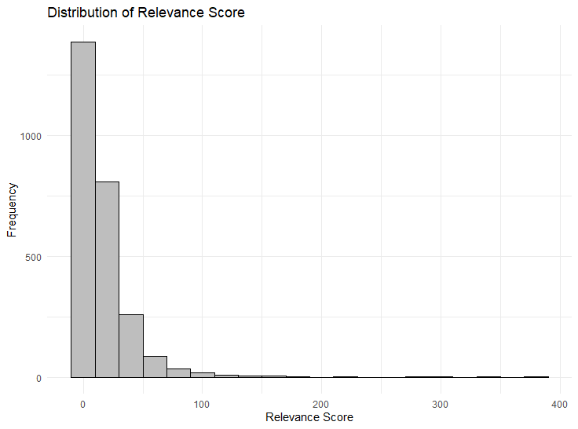
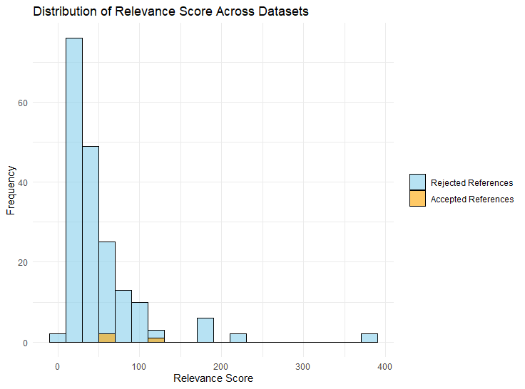

```{r}
knitr::opts_chunk$set(
  collapse = TRUE,
  comment = "#>",
  echo = TRUE,
  message = FALSE,
  warning = FALSE
)
```

```{r packages,include=F,eval=T,echo=F}

pacman::p_load(
   knitr, readxl, httr, leaflet, dplyr, shiny, ggplot2, tidyr
)
```

```{r reading in the data, include=F,eval=T,echo=T }
# Set a directory for downloaded data
dl_dir <- "downloaded_data"

# Create the directory if it doesn't already exist
if(!dir.exists(dl_dir)){
  dir.create(dl_dir, showWarnings = FALSE)
}

# Define the URL and local path for your file
data_url <- "https://raw.githubusercontent.com/Namita-J/climate-impacts-legumes/main/Yield%20Predictions/yield_predictions_data.xlsx"
data_local <- file.path(getwd(), dl_dir, "yield_predictions_data.xlsx")

# Download the file (set 'update=TRUE' to refresh the local copy)
update <- TRUE
if (update) {
  download.file(data_url, data_local, mode = "wb")  # Write in binary mode
}

# Read only the "Dataset" tab from the Excel file
dataset <- readxl::read_excel(data_local, sheet = "Dataset")

# Display a preview of the data
head(dataset)
```

# Introduction

This vignette aims to explore the data on the projected impacts of climate change on legume crops in Africa. It will explore the following:

***Literature Review***

***Methodology:***

*1. Search terms used*

*2. Screening criteria applied*

*3. Screening outcomes*

*4. Data extraction process*

***Data exploration:***

*1. Distribution of papers in Africa*

*2. Comparisons between differnet legumes*

*3. Comparing different climate scenarios*

*4. Understanding how different practices reduce the impacts of climate change*

*5. Treatment vs Control*

***Next steps:***

*1. OpenAlex results*

*2. Introducing other variables*

# Literature Review

# Methodology

## Search Terms Used

To conduct a comprehensive meta-analysis on the climate impacts on legumes in Africa, a systematic literature search was performed using the Web of Science (WoS) database. The search terms were designed to capture studies that explore climate change, its various drivers, and impacts on agricultural productivity, particularly focusing on legumes, within the African context. The search strategy incorporated Boolean operators, proximity operators, and specific geographical filters to ensure relevance and precision. Below are the details of the search terms used:

**Climate Change-Related Terms**

The following terms were used to capture studies focused on climate change, its drivers, and related phenomena:

-   `(climat* NEAR/2 (change* OR warming OR impact* OR variability* OR disruption OR risk* OR shock*))`

-   "global warming"

-   "drought"

-   `(rainfall NEAR/2 (change* OR variability* OR pattern*))`

-   `(heat NEAR/2 (stress OR wave*))`

-   `((CO2 OR carbondioxide OR carbon-dioxide ORM"carbon dioxide" OR "greenhouse gas*")NEAR/2 (emission* OR fertilisation* OR fertilization* OR increase* OR elevat* OR effect*))`

-   `(temperature* NEAR/2 (increase* OR change* OR variabilite* OR global OR trend OR extreme))`

-   `(precipitation* NEAR/2 (change* OR pattern* OR increase* OR trend))`

-   "extreme event\*"

**Agriculture and Food Productivity Terms**

To ensure relevance to agricultural productivity and legumes, the following terms were included:

-   `(((agriculture* OR crop* OR food*) NEAR/2 product*)`

-   "food secure\*"

-   "yield\*"

-   `(crop* NEAR/2 (performance* OR output* OR biomass*))`

-   `(plant* NEAR/2 biomass*)`

-   "harvest\*"

**Geographical Filters**

The search was further refined to include studies conducted in Africa.

**Logical Combination**

The final search string combined all the above elements using the Boolean operator `AND`:

-   Climate-related terms AND Agriculture and food productivity terms AND Geographical filters.

This comprehensive search strategy was implemented to identify all relevant studies addressing climate change impacts on agricultural productivity, particularly legumes, in Africa.

```{r search-terms, echo=T, message=FALSE}
# Create a data frame to hold search terms

search_terms <- data.frame(
  Source = c("WoS"),
  Subject = c("Livestock"),
  Query = paste(
    "(climat* near/2 (change* OR warming OR impact* OR variability* OR disruption OR risk* OR shock*)) OR",
    "\"global warming\" OR drought OR (rainfall near/2 (change* OR variability* OR pattern*)) OR",
    "(heat near/2 (stress OR wave*)) OR ((CO2 OR carbondioxide OR carbon-dioxide OR \"carbon dioxide\"",
    "OR \"greenhouse gas*\") near/2 (emission* OR fertilisation* OR fertilization* OR increase* OR elevat*",
    "OR effect*)) OR (temperature* near/2 (increase* OR change* OR variabilite* OR global OR trend OR extreme)) OR",
    "(precipitation* near/2 (change* OR pattern* OR increase* OR trend) OR \"extreme event*\") AND",
    "(((agriculture* OR crop* OR food*) near/2 product*) OR \"food secure*\" OR yield* OR",
    "(crop* near/2 (performance* OR output* OR biomass*)) OR (plant* near/2 biomass*) OR harvest*) AND",
    "CU=( Angola OR Benin OR Botswana OR Burkina Faso OR Burundi OR Cameroon OR Cape Verde OR",
    "Central African Republic OR Chad OR Comoros OR Congo (Democratic Republic) OR \"Côte d'Ivoire\" OR Djibouti",
    "OR \"Equatorial Guinea\" OR Eritrea OR Ethiopia OR Gabon OR \"The Gambia\" OR Ghana OR Guinea OR \"Guinea-Bissau\"",
    "OR Kenya OR Lesotho OR Liberia OR Madagascar OR Malawi OR Mali OR Mauritania OR Mauritius OR Mozambique OR Namibia",
    "OR Niger OR Nigeria OR Réunion OR Rwanda OR \"Sao Tome and Principe\" OR Senegal OR Seychelles OR \"Sierra Leone\"",
    "OR Somalia OR \"South Africa\" OR Sudan OR Swaziland OR Tanzania OR Togo OR Uganda OR \"Western Sahara\" OR Zambia",
    "OR Zimbabwe)"
  )
)


# Display the table using knitr::kable
kable(search_terms, caption = "Search Terms for Projected of Climate Impacts on Legumes in Africa")
  
```

## Screening criteria applied

This screening criteria is designed to systematically review papers focusing on crop yield impacts, applying both inclusion and exclusion criteria based on specific parameters. The framework ensures that the selected studies align with the objectives of the review.

*Population (P):* The review includes studies focusing on legume crops grown in African countries. The geographic scope is strictly limited to Africa. Studies involving crops other than legumes are excluded.

*Intervention/Practice (I):* Eligible studies must be modeling-based and provide future yield projections. Studies incorporating adaptation strategies, such as reduced tillage or irrigation, are considered highly valuable but not mandatory for inclusion.

*Comparison (C):* Studies should ideally include a control group for comparison. However, for modeling studies, this requirement is flexible and depends on the nature of the projections (e.g., baseline scenarios can serve as controls).

*Outcomes (O):* The primary outcome of interest is projected yield data for legume crops. Studies reporting projections based on different scenarios (e.g., climate change impacts, adaptation strategies) are prioritized.

*Study Design (S):* Only modeling studies are eligible for inclusion. Studies must explicitly include projections for future yields, either with or without adaptation strategies.

## **Screening Outcomes**



# Data exploration

## Distribution of papers in Africa

```{r distribution of papers in Africa, echo=T, message=FALSE}

# Define specific crops for filtering
selected_crops <- c("Common bean", "Groundnut", "Cowpea", "Soybean", "Common Bean", 
                    "Bush Bean", "Climbing Bean", "Faba Bean", "Green grams")

# Subset the dataset (Replace 'dataset' with your actual dataset variable)
filtered_data <- dataset %>%
  filter(Crop %in% selected_crops) %>%
  mutate(
    longitude = as.numeric(longitude),
    latitude = as.numeric(latitude)
  ) %>%
  filter(!is.na(longitude) & !is.na(latitude))  # Ensure valid coordinates

# UI
ui <- fluidPage(
  sidebarLayout(
    sidebarPanel(
      selectInput(
        inputId = "selected_crop",
        label = "Select a Crop:",
        choices = c("All", unique(filtered_data$Crop)),  # Add "All" as an option
        selected = "All"  # Default to "All"
      )
    ),
    mainPanel(
      leafletOutput("map", height = "300px")  # Output for the map
    )
  )
)

# Server
server <- function(input, output, session) {
  output$map <- renderLeaflet({
    # Filter data based on selected crop
    crop_data <- if (input$selected_crop == "All") {
      filtered_data
    } else {
      filtered_data %>% filter(Crop == input$selected_crop)
    }
    
    # Create the leaflet map
    leaflet(data = crop_data) %>%
      addProviderTiles(providers$CartoDB.Positron) %>%
      addCircles(
        lng = ~longitude,
        lat = ~latitude,
        popup = ~paste0(
          "Crop: ", Crop, "<br>"
        ),
        color = "#1f78b4",
        radius = 50000,
        opacity = 0.8,
        fillOpacity = 0.5
      ) %>%
      addLegend(
        position = "bottomleft",
        colors = "#1f78b4",
        labels = "Study Locations",
        title = "Legend"
      )
  })
}
# Run the Shiny App
shinyApp(ui = ui, server = server)

```

## Comparisons between different legumes

This script analyzes the impact of climate on the yield of selected legumes by filtering the dataset to include specific crops with available data on climate impacts, ensuring no missing values in the Climate impacts (%) column. The data is grouped by crop, and the number of observations for each crop is calculated to provide context for the analysis.

The plot reveals the distribution of climate impacts across different crops, highlighting trends in the data.Some crops, such as Common Bean and Groundnut, exhibit a wider range of climate impacts, with both positive and negative extremes. In contrast, crops like Green Grams show relatively limited variability, suggesting more consistent responses to climate factors. However, this is also attributed the number of papers done for each of these crops.

Additionally, certain crops, such as Cowpea and Soybean, display clusters of outliers, indicating occasional extreme climate impacts that deviate from the general trend.

```{r box plots of different legumes, echo=T, message=FALSE}
# Filter data for specific crops
filtered_data <- dataset %>%
  filter(Crop %in% selected_crops) %>%
  filter(!is.na(`Climate impacts (%)`))  # Ensure 'Climate impacts (%)' is not NA

# Count observations for each crop
filtered_data <- filtered_data %>%
  group_by(Crop) %>%
  mutate(Count = n()) %>%
  ungroup()

# Create the boxplot
ggplot(filtered_data, aes(x = `Climate impacts (%)`, y = reorder(Crop, Count, .desc = TRUE))) +
  geom_boxplot(outlier.size = 1, outlier.color = "red") +
  geom_vline(xintercept = 0, color = "red", linetype = "dashed") +
  labs(
    x = "Climate Impact (%)",
    y = "Crop (n)",
    title = "Climate Impact (%) on yield of Selected Crops"
  ) +
  theme_minimal(base_size = 14) +
  theme(
    axis.title.y = element_text(size = 12),
    axis.title.x = element_text(size = 12),
    axis.text.y = element_text(size = 10)
  )
```

## Comparing different climate scenarios

This analysis explores how different climate scenarios impact crop yields, combining insights from both CMIP5 (RCP scenarios) and CMIP6 (SSP scenarios). The dataset focuses on selected crops and scenarios where reliable data on Climate impacts (%) is available, allowing for a meaningful comparison. By including both RCPs and SSPs, the analysis bridges older and newer climate modeling frameworks, recognizing the ongoing relevance of CMIP5 data in climate research and its ability to provide valuable insights alongside the more recent CMIP6 projections.

The plot reveals some clear trends. Under high-emission scenarios like RCP8.5 and SSP585, the variability in climate impacts is much wider, with a notable number of positive impacts, suggesting that certain crops might benefit under these extreme warming conditions. On the other hand, low-emission scenarios like SSP126 and RCP2.6 show more consistent impacts, with narrower ranges and fewer extreme values. This reflects the more moderated effects expected when strong mitigation measures are implemented.

Despite the release of CIMP6,this study chose to retain crop yield projections done with CIMP5 and CIMP3 as they still provide valuable insights.

```{r box plots of different climate scenarios, echo=T, message=FALSE}
# Filter data for specific crops and climate scenarios
filtered_data <- dataset %>%
  filter(Crop %in% selected_crops) %>%
  filter(!is.na(`Climate impacts (%)`)) %>%  # Ensure 'Climate impacts (%)' is not NA
  filter(`Climate scenario` %in% c("RCP8.5", "RCP4.5", "RCP2.6", "SSP370", "SSP126", "SSP585"))  # Include only specified scenarios

# Count observations for each climate scenario
filtered_data <- filtered_data %>%
  group_by(`Climate scenario`) %>%
  mutate(Count = n()) %>%
  ungroup()

# Create the boxplot
ggplot(filtered_data, aes(x = `Climate impacts (%)`, y = reorder(`Climate scenario`, Count, .desc = TRUE))) +
  geom_boxplot(outlier.size = 1, outlier.color = "red") +
  geom_vline(xintercept = 0, color = "red", linetype = "dashed") +
  labs(
    x = "Climate Impact (%)",
    y = "Climate Scenario",
    title = "Climate Impact (%) on yield for different Climate Scenarios"
  ) +
  theme_minimal(base_size = 14) +
  theme(
    axis.title.y = element_text(size = 12),
    axis.title.x = element_text(size = 12),
    axis.text.y = element_text(size = 10)
  )


```

## Understanding how different practices reduce the impacts of climate change

This script explores how different adaptation strategies help mitigate the effects of climate change on crop yields. The analysis focuses on selected crops with valid data on Climate impacts (%) and groups the strategies to evaluate their effectiveness. The plot reveals that approaches like using high fertilizer levels and selecting specific cultivars are particularly effective at reducing negative impacts. In contrast, strategies like late planting show greater variability and higher risks. Combined strategies stand out for their consistent results, offering solutions to enhance crop resilience.

```{r box plots of different strategies, echo=T, message=FALSE}
# Filter data for specific crops
filtered_data <- dataset %>%
  filter(Crop %in% selected_crops) %>%
  filter(!is.na(`Climate impacts (%)`))  # Ensure 'Climate impacts (%)' is not NA

# Count observations for each crop
filtered_data <- filtered_data %>%
  group_by(`Adaptation type`) %>%
  mutate(Count = n()) %>%
  ungroup()

# Create the boxplot
ggplot(filtered_data, aes(x = `Climate impacts (%)`, y = reorder(`Adaptation type`, Count, .desc = TRUE))) +
  geom_boxplot(outlier.size = 1, outlier.color = "red") +
  geom_vline(xintercept = 0, color = "red", linetype = "dashed") +
  labs(
    x = "Climate Impact (%)",
    y = "Adaptation type",
    title = "Climate Impact (%) on yield with different adaptation strategies"
  ) +
  theme_minimal(base_size = 14) +
  theme(
    axis.title.y = element_text(size = 12),
    axis.title.x = element_text(size = 12),
    axis.text.y = element_text(size = 10)
  )
```

## Treatment vs control

The treatment vs. control approach greatly reduces the number of studies included (7), as most focus on a single adaptation strategy rather than projecting both scenarios. This script filters the dataset for selected crops, separating "no adaptation" (control) and specific adaptation strategies (treatment). The two groups are merged based on shared attributes like site, crop, and climate scenario, allowing for direct comparisons.

The plot shows yield changes across management strategies, with "no adaptation" as the baseline. Strategies like combination approaches and irrigation consistently improve yields, while others, such as late planting, show mixed results. Despite limited data availability, this analysis highlights the value of directly comparing treatment and control to assess the real impact of adaptation strategies

```{r trt vs control, echo=T, message=FALSE}

filtered_data <- dataset %>%
  filter(Crop %in% selected_crops)

# Create the control dataset
control_data <- filtered_data %>%
  filter(`Adaptation type` == "No") %>%
  rename(YieldChange_Control = `Climate impacts (%)`)

# Create the treatment dataset
treatment_data <- filtered_data %>%
  filter(`Adaptation type` != "No") %>%
  rename(YieldChange_Treatment = `Climate impacts (%)`)

# Merge control and treatment datasets
merged_data <- merge(
  control_data,
  treatment_data,
  by = c("Ref No", "Future_Mid-point", "Climate scenario",  
         "Site(location)", "Crop","GCM/RCM","Crop Model"),
  all = FALSE
)

# Separate no adaptation and other strategies
plot_data <- merged_data %>%
  pivot_longer(
    cols = c(YieldChange_Control, YieldChange_Treatment),
    names_to = "Management_Type",
    values_to = "YieldChange"
  ) %>%
  mutate(
    Management_Group = case_when(
      Management_Type == "YieldChange_Control" ~ "no adaptation",
      TRUE ~ `Adaptation type.y`
    )
  )

ggplot(plot_data, aes(
  x = YieldChange,
  y = Management_Group,
  color = Crop
)) +
  geom_point(size = 3, alpha = 0.8) +
  labs(
    title = "Yield Change: Control vs. Treatment (Filtered)",
    x = "Yield Change (%)",
    y = "Management Group",
    color = "Crop"
  ) +
  theme_minimal() +
  theme(axis.text.y = element_text(size = 10))

```

# Next steps

## OpenAlex results

***OpenAlex query***

This script automates the process of querying the OpenAlex API for research on climate change, agriculture, and African regions. It constructs Boolean search strings for climate, agriculture, and regional terms, combines them into a final query, and retrieves results within a specified date range (1970--2024). The results, including key details like title and DOI, are saved in a CSV file for analysis.\
\
The result was **2492** search hits.



The majority of references have low relevance scores, as shown by the high frequency of scores concentrated near zero. There is a rapid decline in frequency as relevance scores increase, with very few references scoring above 100. This pattern suggests that most of the retrieved works have only moderate alignment with the search criteria, while a small subset demonstrates stronger relevance to the specified terms.\
\
Unhide to see the script

```{r Openalex query, eval=F, echo=T, message=FALSE}
# Carr et al search terms testing
# 0) Set up workspace ####
# 0.1) Load packages #####
# Use p_load to install if not present and load the packages
pacman::p_load(data.table,openalexR)

# 0.2) Create functions #####
add_quotes <- function(vector) {
  sapply(vector, function(term) {
    if (grepl("\\s", term)) {
      return(shQuote(term, type = "cmd"))
    } else {
      return(term)
    }
  }, USE.NAMES = FALSE)
}
# Specify your main project directory on your local drive
project <- "1. Synthesis_Climate change impacts on legumes/OpenAlex"

# Define the path again in case it reset
search_data_dir <- "OpenAlex/search_data"

# Create the directory if it does not exist
if (!dir.exists(search_data_dir)) {
  dir.create(search_data_dir, recursive = TRUE)
}

# Check if the directory now exists
print(dir.exists(search_data_dir))  # Should print TRUE if created successfully

# 1) Create terms ####
# Read in additional animal breed terms provided by Claudia Arndt's team
climate_terms <- c("climate change", "global warming", "drought", "rainfall variability", "heat stress", 
                   "CO2 emission", "greenhouse gas", "temperature increase", "extreme event")
agriculture_terms <- c("agriculture production", "crop yield", "food security", "crop performance", 
                       "plant biomass", "harvest")
region_terms <- c("Angola", "Benin", "Botswana", "Burkina Faso", "Cameroon", "Ethiopia", "Ghana", 
                  "Kenya", "Malawi", "Nigeria", "South Africa", "Tanzania", "Uganda", "Zimbabwe")


# Convert to Boolean expressions
climate_boolean <- paste0("(", paste0(climate_terms, collapse = " OR "), ")")
agriculture_boolean <- paste0("(", paste0(agriculture_terms, collapse = " OR "), ")")
region_boolean <- paste0("(", paste0(region_terms, collapse = " OR "), ")")

# Final combined search string
final_search_string <- paste(
  climate_boolean, 
  "AND", 
  agriculture_boolean, 
  "AND", 
  region_boolean
)

# Save terms for reference
terms <- list(
  climate = climate_boolean,
  agriculture = agriculture_boolean,
  region = region_boolean,
  full_search = final_search_string
)

save(terms, file = file.path(search_data_dir, "climate_agriculture_region_search_terms.RData"))

# Set date range for the search
from_year <- "1970-01-01"
to_year <- "2024-10-30"
overwrite <- TRUE  # Set to overwrite existing files if needed

# Set prefix for file naming
prefix <- "openalex"
save_file <- file.path(search_data_dir, paste0(prefix, "_climate_agriculture_region15.csv"))

# Run OpenAlex query
if (!file.exists(save_file) | overwrite) {
  # Create the API endpoint with the search string
  api_endpoint <- oa_query(
    entity = "works",
    title_and_abstract.search = terms$full_search,
    from_publication_date = from_year,
    to_publication_date = to_year
  )
  
  # Check if the search string is within the allowed length
  if (nchar(api_endpoint) > 4000) {
    stop(paste0("Encoded search string has ", nchar(api_endpoint), " characters. Max allowed is 4000."))
  }
  
  # Execute the query and save the results
  hits <- oa_request(query_url = api_endpoint)
  hits_tab <- data.table(oa2df(hits, entity = "works"))
  
  # Select and save relevant fields
  hits_tab <- hits_tab[, .(id, display_name, doi, url, relevance_score, language, type, publication_date)]
  fwrite(hits_tab, file = save_file)
}
###########################################################################
# Test a simpler query without the region filter
test_search_string <- paste(climate_boolean, "AND", agriculture_boolean)
api_endpoint_test <- oa_query(
  entity = "works",
  title_and_abstract.search = test_search_string,
  from_publication_date = from_year,
  to_publication_date = to_year
)
# Execute and check results
test_hits <- oa_request(query_url = api_endpoint_test)
test_hits_tab <- data.table(oa2df(test_hits, entity = "works"))
print(nrow(test_hits_tab))  # Check how many results this yields

```

***OpenAlex valibation***

This script compares results from two bibliographic databases, Web of Science (WoS) and OpenAlex, to assess overlap and relevance in identifying studies on climate change impacts on legumes. It begins by loading accepted and rejected WoS references, cleaning and standardizing titles and DOIs for consistent matching.

OpenAlex query results are also processed similarly, ensuring compatibility. Matches are identified by comparing titles and DOIs across datasets, with duplicates removed. Matched data is analyzed to assess overlap, including creating histograms to visualize the distribution of relevance scores for accepted and rejected references. Additionally, the script includes functionality to fetch records from OpenAlex using DOIs and partial title matching.

```{r openalex validation, eval=F, echo=T, message=FALSE}
#Testing OpenAlex vs Wos

#Loading accepted and rejected WoS results 
# Load necessary package
library(openalexR)
library(data.table)
library(ggplot2)


# Define the file path
accepted <- "C:/Users/JNamita/OneDrive - CGIAR/PhD- Namita/1. Synthesis_Climate change impacts on legumes/WoS/To Extract.csv"
rejected <- list(
  "C:/Users/JNamita/OneDrive - CGIAR/PhD- Namita/1. Synthesis_Climate change impacts on legumes/WoS/1. No crop.csv",
  "C:/Users/JNamita/OneDrive - CGIAR/PhD- Namita/1. Synthesis_Climate change impacts on legumes/WoS/1. No future projections.csv",
  "C:/Users/JNamita/OneDrive - CGIAR/PhD- Namita/1. Synthesis_Climate change impacts on legumes/WoS/2. No future projections.csv",
  "C:/Users/JNamita/OneDrive - CGIAR/PhD- Namita/1. Synthesis_Climate change impacts on legumes/WoS/2. No outcome.csv",
  "C:/Users/JNamita/OneDrive - CGIAR/PhD- Namita/1. Synthesis_Climate change impacts on legumes/WoS/3. Not Africa.csv",
  "C:/Users/JNamita/OneDrive - CGIAR/PhD- Namita/1. Synthesis_Climate change impacts on legumes/WoS/3. Synthesis.csv",
  "C:/Users/JNamita/OneDrive - CGIAR/PhD- Namita/1. Synthesis_Climate change impacts on legumes/WoS/4. No Yield.csv",
  "C:/Users/JNamita/OneDrive - CGIAR/PhD- Namita/1. Synthesis_Climate change impacts on legumes/WoS/4. Not Africa.csv",
  "C:/Users/JNamita/OneDrive - CGIAR/PhD- Namita/1. Synthesis_Climate change impacts on legumes/WoS/5. Yield stability-suitability.csv",
  "C:/Users/JNamita/OneDrive - CGIAR/PhD- Namita/1. Synthesis_Climate change impacts on legumes/WoS/6. Non-modelled crop predictions.csv"
)


# Load the CSV file using fread from data.table for efficient reading
accepted_data <- fread(accepted, header = TRUE)

# Combine all rejected files into one data table
rejected_data <- rbindlist(lapply(rejected, function(f) fread(file = f)), use.names = TRUE, fill = TRUE)

# Preview the first few rows of the data to confirm it's loaded correctly
head(accepted_data)
head(rejected_data)

##Finding matches between accepted references and openalex hits
hits <- fread("C:/Users/JNamita/OneDrive - CGIAR/PhD- Namita/1. Synthesis_Climate change impacts on legumes/OpenAlex/search_data/openalex_climate_agriculture_region15.csv")
# Step 1: Rename columns for consistency
setnames(rejected_data, old = "Title", new = "display_name")
setnames(rejected_data, old = "DOI", new = "doi")  # Assuming DOI is the column name in accepted_data for DOI
setnames(accepted_data, old = "Title", new = "display_name")
setnames(accepted_data, old = "DOI", new = "doi")  # Assuming DOI is the column name in accepted_data for DOI

# Step 2: Clean and standardize the titles
rejected_data[, display_name := tolower(trimws(display_name))]  # Trim whitespace and make lowercase
accepted_data[, display_name := tolower(trimws(display_name))]
hits[, display_name := tolower(trimws(display_name))]     # Trim whitespace and make lowercase

# Step 3: Clean and standardize the DOIs
hits[, doi := tolower(sub("https://doi.org/", "", doi))]
rejected_data[, doi := tolower(trimws(doi))]  # Ensure lowercase and trim whitespace in accepted_data DOIs
accepted_data[, doi := tolower(trimws(doi))]

rejected_data_unique <- unique(rejected_data, by = "doi")
accepted_data_unique <- unique(accepted_data, by = "doi")
hits_unique <- unique(hits, by = "doi")

# Check a few sample DOIs that should match
print("Sample of DOIs in accepted_data:")
print(head(accepted_data$doi, 5))

print("Sample of DOIs in hits:")
print(head(hits$doi, 5))

print("Sample of Titles in accepted_data:")
print(head(accepted_data$display_name, 5))

print("Sample of Titles in hits:")
print(head(hits$display_name, 5))

# Step 3.1: Perform the merge based on display_name and doi- for rejected papers
# This will return only the rows in both datasets where the titles and DOIs match
matched_by_title <- merge(rejected_data_unique, hits_unique[, .(display_name, doi, relevance_score)], 
                          by = "display_name", all = FALSE)
# Perform the merge with allow.cartesian set to TRUE
matched_by_doi <- merge(rejected_data_unique, hits_unique[, .(display_name, doi, relevance_score)], 
                        by = "doi", all = FALSE)
dup_dois_rejected <- rejected_data[duplicated(rejected_data$doi), ]
cat("Number of duplicate DOIs in rejected_data:", nrow(dup_dois_rejected), "\n")
dup_dois_accepted <- accepted_data[duplicated(accepted_data$doi), ]
cat("Number of duplicate DOIs in accepted_data:", nrow(dup_dois_accepted), "\n")
dup_dois_hits <- hits[duplicated(hits$doi), ]
cat("Number of duplicate DOIs in hits:", nrow(dup_dois_hits), "\n")

# Combine the two data tables, allowing for missing columns in either
matched_data<- unique(rbindlist(list(matched_by_title, matched_by_doi), fill = TRUE), 
                       by = c("display_name", "doi"))

# Step 3.2: Perform the merge based on display_name and doi for accepted papers
# This will return only the rows in both datasets where the titles and DOIs match
matched_by_title_a <- merge(accepted_data_unique, hits_unique[, .(display_name, doi, relevance_score)], 
                          by = "display_name", all = FALSE)
# Perform the merge with allow.cartesian set to TRUE
matched_by_doi_a <- merge(accepted_data_unique, hits_unique[, .(display_name, doi, relevance_score)], 
                        by = "doi", all = FALSE)
dup_dois_rejected <- accepted_data[duplicated(accepted_data$doi), ]
cat("Number of duplicate DOIs in rejected_data:", nrow(dup_dois_accepted), "\n")

dup_dois_hits <- hits[duplicated(hits$doi), ]
cat("Number of duplicate DOIs in hits:", nrow(dup_dois_hits), "\n")

# Combine the two data tables, allowing for missing columns in either
matched_data_a <- unique(rbindlist(list(matched_by_title_a, matched_by_doi_a), fill = TRUE), 
                       by = c("display_name", "doi"))


# Preview the combined matched data
print("Preview of combined matched data:")
print(head(matched_data_a))


# Plot the histogram of relevance_score fir one dataset
ggplot(hits_unique, aes(x = relevance_score)) +
  geom_histogram(binwidth = 20, color = "black", fill = "grey") +
  labs(
    title = "Distribution of Relevance Score",
    x = "Relevance Score",
    y = "Frequency"
  ) +
  theme_minimal()

# Plot the histogram of relevance_score for 2 datasets
# Add a "source" column to each dataset
matched_data$source <- "matched_data"
matched_data_a$source <- "matched_data_a"
hits$source <- "hits"

# Select only the `relevance_score` and `source` columns, and combine them
combined_data <- rbind(
  matched_data[, .(relevance_score, source)],
  matched_data_a[, .(relevance_score, source)]
)

# Convert `source` to a factor with specific levels
# combined_data$source <- factor(combined_data$source, levels = c("matched_data", "matched_data_a", "hits_unique"))

# Plot the combined histogram with different colors for each dataset
# Plot the combined histogram with custom legend labels
ggplot(combined_data, aes(x = relevance_score, fill = source)) +
  geom_histogram(binwidth = 20, position = "identity", alpha = 0.6, color = "black") +
  scale_fill_manual(
    values = c("matched_data" = "skyblue", "matched_data_a" = "orange"),
    labels = c("matched_data" = "Rejected References", 
               "matched_data_a" = "Accepted References"
               )
  ) +
  labs(
    title = "Distribution of Relevance Score Across Datasets",
    x = "Relevance Score",
    y = "Frequency",
    fill = "Dataset"
  ) +
  theme_minimal()

# Assume that `accepted_data` is already cleaned and contains the relevant DOIs and Titles
# Convert DOI column to lowercase and clean up any DOI links
accepted_data_unique[, doi := tolower(trimws(gsub("https://doi.org/|http://dx.doi.org/", "", doi)))]
accepted_data_unique[, display_name := tolower(gsub("[^a-zA-Z0-9 ]", "", display_name))]  # Clean title for OpenAlex search

# Fetch OpenAlex records for DOIs
oa_dois <- data.table(oa_fetch(
  entity = "works",
  doi = accepted_data_unique[!is.na(doi), doi],
  verbose = TRUE
))[, indexed_oa := "yes"
][, .(doi, indexed_oa)]  # Keep only DOI and index status columns

# Clean up DOI format in OpenAlex data to match accepted_data format
oa_dois[, doi := trimws(gsub("https://doi.org/|http://dx.doi.org/", "", doi))]

# Fetch OpenAlex records for titles (using partial matching by title search)
oa_titles <- rbindlist(lapply(1:nrow(accepted_data), function(i) {
  data <- data.table(oa_fetch(
    entity = "works",
    display_name.search = accepted_data[i, display_name],
    verbose = TRUE
  ))[, indexed_oa := "yes"
  ][, .(title = accepted_data[i, display_name], indexed_oa)]
  data
}))

################################################################
# Ensure both datasets are data tables
library(data.table)
accepted_data <- as.data.table(accepted_data)
test_hits_tab <- as.data.table(test_hits_tab)

# Step 1: Standardize and Clean `display_name` and `doi` Columns
accepted_data[, display_name := tolower(trimws(display_name))]  # Convert titles to lowercase and trim whitespace
test_hits_tab[, display_name := tolower(trimws(display_name))]

# Clean and standardize DOIs
accepted_data[, doi := tolower(trimws(gsub("https://doi.org/", "", doi)))]
test_hits_tab[, doi := tolower(trimws(gsub("https://doi.org/", "", doi)))]

# Step 2: Match by `display_name` (Title)
matched_by_title_test <- merge(
  accepted_data, 
  test_hits_tab[, .(display_name, doi, relevance_score)],  # Keep only necessary columns
  by = "display_name", 
  all = FALSE, 
  allow.cartesian = TRUE  # Allows for multiple matches if there are duplicate titles
)

# Step 3: Match by `doi`
matched_by_doi <- merge(
  accepted_data, 
  test_hits_tab[, .(display_name, doi, relevance_score)], 
  by = "doi", 
  all = FALSE, 
  allow.cartesian = TRUE
)

# Step 4: Combine the Results and Remove Duplicates
# Use rbindlist to combine matches by title and by DOI
matched_data <- unique(rbindlist(list(matched_by_title, matched_by_doi), fill = TRUE), by = c("display_name", "doi"))

# Step 5: Preview Results
print("Preview of matched data between accepted_data and test_hits_tab:")
print(head(matched_data))
cat("Total number of matches found:", nrow(matched_data), "\n")

```



There were only 3 matches with accepted papers from WoS.

Screening OpenAlex references may give us a few more papers to add

## An analysis with other varibles
